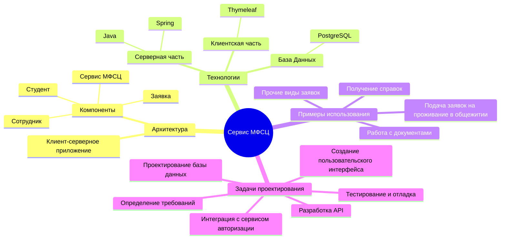
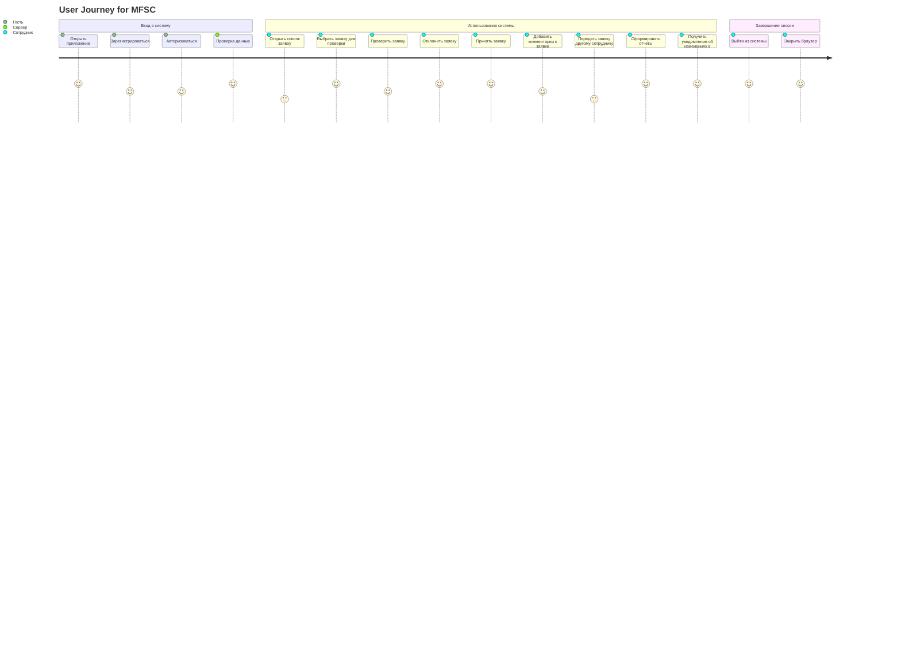
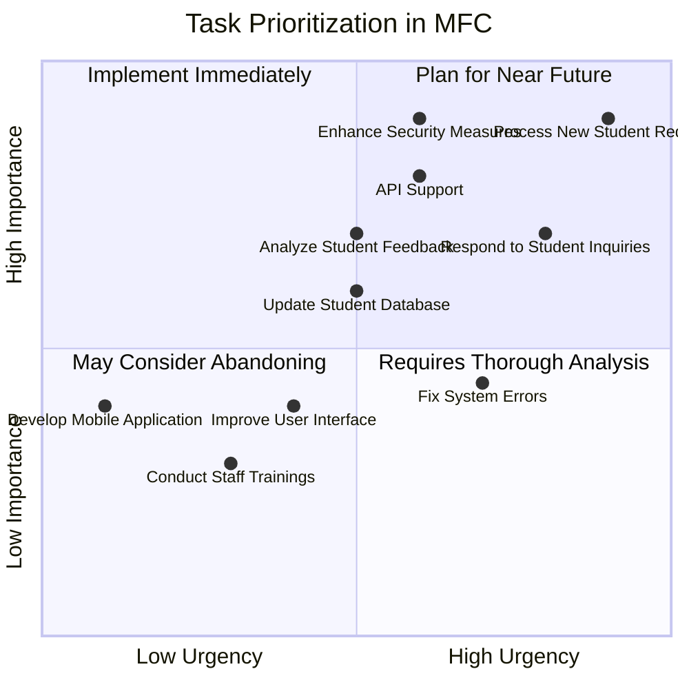
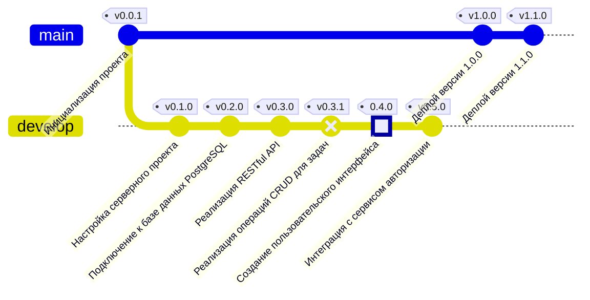

```mermaid
mindmap
  root((Сервис МФСЦ))
    Архитектура
      Клиент-серверное приложение
      ::icon(fa fa-server)
      Компоненты
        Студент
        Сервис МФСЦ
        Сотрудник
        Заявка
    Технологии
      Серверная часть
        Spring
        Java
      База Данных
        PostgreSQL
      Клиентская часть
        Thymeleaf
    Примеры использования
      Подача заявок на проживание в общежитии
      Получение справок
      Работа с документами
      Прочие виды заявок
    Задачи проектирования
      Определение требований
      Проектирование базы данных
      Разработка API
      Создание пользовательского интерфейса
      Интеграция с сервисом авторизации
      Тестирование и отладка
```

```mermaid
journey
    title User Journey for MFSC
    section Вход в систему
      Открыть приложение: 5: Гость
      Зарегистрироваться: 4: Гость
      Авторизоваться: 4: Гость
      Проверка данных: 5: Сервер
    
    section Использование системы
      Открыть список заявоу: 3: Сотрудник
      Выбрать заявку для проверки: 5: Сотрудник
      Проверить заявку: 4: Сотрудник
      Отклонить заявку: 5: Сотрудник
      Принять заявку: 5: Сотрудник
      Добавить комментарии к заявке: 4: Сотрудник
      Передать заявку другому сотруднику: 3: Сотрудник
      Сформировать отчеты: 5: Сотрудник
      Получить уведомление об изменениях в заявке: 5: Сотрудник

    section Завершение сессии
      Выйти из системы: 5: Сотрудник
      Закрыть браузер: 5: Сотрудник
```

```mermaid
quadrantChart
    title Task Prioritization in MFC
    x-axis Low Urgency --> High Urgency
    y-axis Low Importance --> High Importance
    quadrant-1 Plan for Near Future
    quadrant-2 Implement Immediately
    quadrant-3 May Consider Abandoning
    quadrant-4 Requires Thorough Analysis
    Process New Student Requests: [0.9, 0.9]
    Respond to Student Inquiries: [0.8, 0.7]
    API Support: [0.6, 0.8]
    Update Student Database: [0.5, 0.6]
    Fix System Errors: [0.7, 0.44]
    Improve User Interface: [0.4, 0.4]
    Conduct Staff Trainings: [0.3, 0.3]
    Enhance Security Measures: [0.6, 0.9]
    Develop Mobile Application: [0.1, 0.4]
    Analyze Student Feedback: [0.5, 0.7]
```

```mermaid
gitGraph
  commit id: "Инициализация проекта" tag: "v0.0.1"
  branch develop
  commit id: "Настройка серверного проекта" tag: "v0.1.0"
  commit id: "Подключение к базе данных PostgreSQL" tag: "v0.2.0"
  commit id: "Реализация RESTful API" tag: "v0.3.0"
  commit id: "Реализация операций CRUD для задач" type: REVERSE tag: "v0.3.1"
  commit id: "Создание пользовательского интерфейса" type: HIGHLIGHT tag: "0.4.0"
  commit id: "Интеграция с сервисом авторизации" tag: "v0.5.0"
  checkout main
  commit id: "Деплой версии 1.0.0" tag: "v1.0.0"
  commit id: "Деплой версии 1.1.0" tag: "v1.1.0"
```
